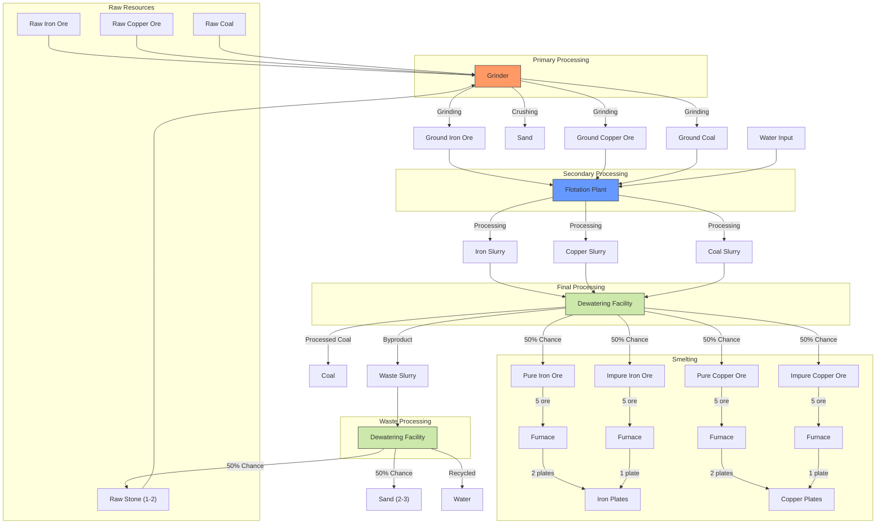
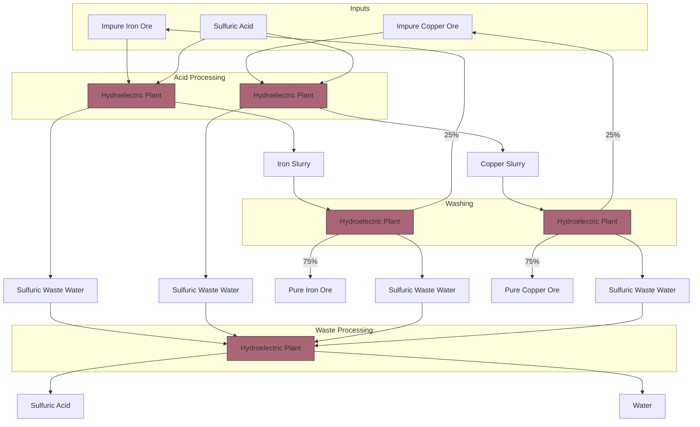

# Processing Flowcharts

This document details the processing chains for mineral processing in the Respectively Artificial mod.

## Base Processing Chain

## Processing Stages

### 1. Raw Resource Extraction
- Raw Iron Ore
- Raw Copper Ore
- Raw Coal
- Raw Stone

### 2. Primary Processing (Grinder)
- Converts raw materials into ground form
- Increases surface area for better processing
- No fluid requirements
- Energy consumption: 75kW

### 3. Secondary Processing (Flotation Plant)
- Processes ground materials with water
- Separates minerals based on physical properties
- Requires water input
- Creates mineral slurry
- Energy consumption: 150kW

### 4. Final Processing (Dewatering Facility)
- Removes water from mineral slurries
- Produces final processed materials
- Outputs waste water
- Energy consumption: 200kW

## Resource Flow Details

1. **Raw Resources → Grinder**
   - Raw materials are fed directly into the grinder
   - No additional inputs required
   - Produces ground material

2. **Grinder → Flotation Plant**
   - Ground material enters flotation process
   - Water is added to create slurry
   - Minerals are separated through flotation

3. **Flotation Plant → Dewatering Facility**
   - Mineral slurry is processed
   - Water is removed
   - Final products are created
   - Waste water is produced as byproduct

Note: The above flowchart represents the basic processing chain.

## Sulfuric Acid Processing Chain

### 5. Advanced Processing (Hydroelectric Plant)
- Processes impure ores with sulfuric acid
- Creates mineral slurries
- Higher yield than basic flotation (75% pure ore)
- Reclaims sulfuric acid from waste water
- Energy consumption: 150kW

### Acid Processing Flow Details

1. **Impure Ores → Acid Processing**
   - Impure ores from basic flotation are processed with sulfuric acid
   - Produces mineral slurries and sulfuric waste water
   - More efficient than re-running through basic flotation

2. **Slurry → Washing**
   - Mineral slurries are washed to separate pure and impure ores
   - 75% chance of pure ore output
   - 25% chance of impure ore (can be recycled)
   - Produces additional sulfuric waste water

3. **Waste Processing → Reclamation**
   - Sulfuric waste water is processed
   - Reclaims sulfuric acid
   - Produces clean water as byproduct
   - Creates sustainable acid processing cycle